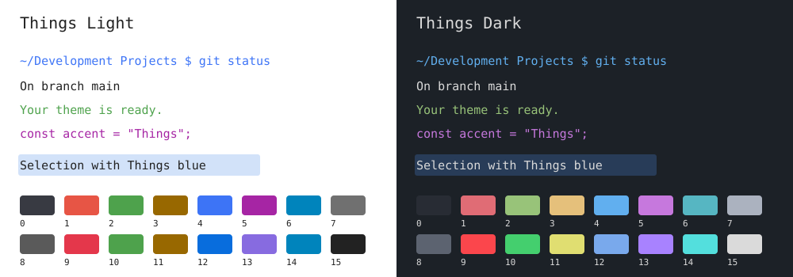

# Things for Ghostty

A terminal adaptation of [Things for Obsidian](https://github.com/colineckert/obsidian-things), by Colin Eckert. Colors come from the installed Things 2.2.4 CSS. The upstream MIT notice is retained in [LICENSE](LICENSE).



## Install

```sh
python3 install.py
```

The installer copies both themes to Ghostty's user configuration folder and selects the system appearance. On macOS it uses `~/Library/Application Support/com.mitchellh.ghostty/themes` with absolute theme paths, so a root-owned `~/.config/ghostty/themes` is harmless. On Linux it uses `$XDG_CONFIG_HOME/ghostty` or `~/.config/ghostty`.

The installer preserves other preferences, validates the proposed configuration with Ghostty, and saves `config.before-things-TIMESTAMP` alongside an existing configuration before changing it. Existing direct color overrides take precedence over theme colors.

Press **Cmd+Shift+comma** in Ghostty on macOS to reload. The installed Ghostty 1.3.1 reports `super+shift+,=reload_config`. Installation does not restart Ghostty or close sessions. The running terminal's reload could not be automated because this environment does not permit computer control of Ghostty.

For a fixed appearance, replace the `theme` setting with the absolute installed path to `Things Light` or `Things Dark`. The paired form used by the installer is:

```ini
theme = light:/absolute/path/Things Light,dark:/absolute/path/Things Dark
```

## Colors and limits

| Role | Light | Dark |
| --- | --- | --- |
| Obsidian editor background | `#ffffff` | `#1c2127` |
| Normal text | `#222222` | `#dadada` |
| Things accent cursor | `#4c8ce6` | `#79a9ec` |
| Selection composite | `#d2e2f9` | `#283c58` |
| Split divider | `#ebedf0` | `#35393e` |

ANSI colors 1 through 6 use Things' Atom syntax red, green, orange/yellow, blue, purple and aqua. Light ANSI yellow uses Atom orange `#986800`, since Things' light variable named `atom-yellow` is red. Bright colors use suitable Things status colors; light green, yellow and cyan retain syntax colors so they remain readable on white. Selection colors flatten Things' 25% blue selection over the editor background, with the light accent also used by Obsidian's dark interactive selection. HSL values are converted to 8-bit sRGB and rounded consistently with the companion themes.

The terminal keeps its font and layout preferences. Ghostty cannot reproduce Obsidian's note typography, sidebar cards or CSS spacing through a color theme. Programs that emit their own truecolor values can override the ANSI palette. Ghostty documents a macOS tab titlebar style issue during light/dark switches; no sessions are restarted to work around it.

## Validate and undo

```sh
/Applications/Ghostty.app/Contents/MacOS/ghostty +validate-config
```

To undo installation, copy the saved `config.before-things-TIMESTAMP` over the adjacent `config` file, then reload Ghostty. Remove the two installed theme files if no configuration refers to them. Choose your exact backup from the installer output.

The theme files and system-switching configuration passed native Ghostty 1.3.1 validation. [Ghostty's official theme reference](https://ghostty.org/docs/config/reference#theme) documents absolute paths, paired appearances and override precedence. The SVG is a palette illustration, not an application screenshot.
